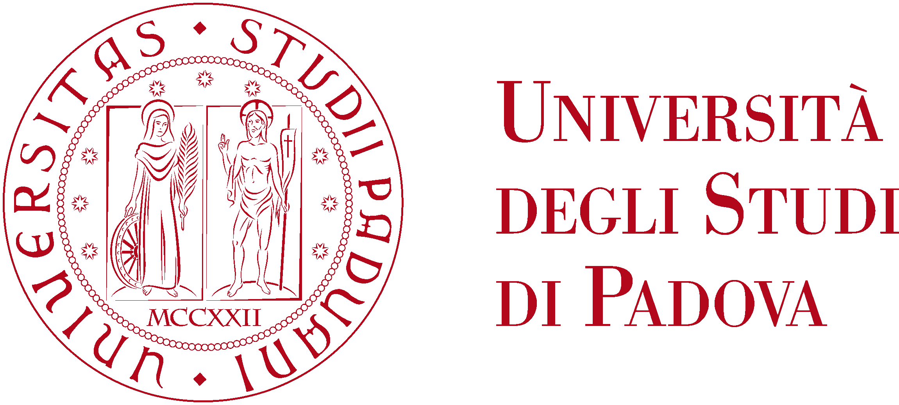

# Numerical Methods for Soft Matter (NMSM) 2024-2025

The following repository contains the exercises for the UniPD course **Numerical Methods for Soft Matter** for the academic year 2024-2025.
The main focus of the course is mainly about Monte Carlo methods applied to Statistical Mechanics and Molecular dynamics.
All programs are made in Python and where possible were optimized using the **Numba** and the **Numpy** package.
Comprehensive reports about the underlying Physics and aspects of the simulation are present for [block 1](https://github.com/nunziatodamino/NMSM_2024/blob/main/Block%201/Report/main.pdf) and [block 2](https://github.com/nunziatodamino/NMSM_2024/blob/main/Block_2/Report/main.pdf).

## Block 1 (**Sampling methods and Monte Carlo techniques**)

### **Lecture 1: [Volume Estimation and Sampling Methods](https://github.com/nunziatodamino/NMSM_2024/tree/main/Block%201/Exercise_1)**  
Estimate the volume of ellipsoids using the hit-and-miss Monte Carlo method. Compare results for different parameters (e.g., ellipsoid axes) and study of  sampling efficiency for different cases.

### **Lecture 2: [Rejection and Inversion Sampling](https://github.com/nunziatodamino/NMSM_2024/tree/main/Block%201/Exercise_2)**  
Generate random numbers from non-trivial PDFs (e.g., ρ(x) ∝ x e⁻ˣ²) using inversion and rejection methods. Validate results via histograms and compare with theoretical distributions.

### **Lecture 3: [Importance Sampling and Integration](https://github.com/nunziatodamino/NMSM_2024/tree/main/Block%201/Exercise_3)**  
Compute integrals using crude Monte Carlo and optimized importance sampling. Compare errors between uniform and normal sampling.

### **Lecture 4: [Markov Chain Classification](https://github.com/nunziatodamino/NMSM_2024/tree/main/Block%201/Exercise_4)**  
Classify states of Markov chains (transient/recurrent, periodicity) by analyzing transition matrices. Draw digraphs to visualize state connectivity.

### **Lecture 5: [2D Ising Model Simulation](https://github.com/nunziatodamino/NMSM_2024/tree/main/Block%201/Exercise_5)**  
Simulate a 2D Ising model using the Metropolis algorithm. Study phase transitions by computing magnetization, energy, fluctuations, and autocorrelation times near T_c.

### **Lecture 6: [Polymer Adsorption (MMC)](https://github.com/nunziatodamino/NMSM_2024/tree/main/Block%201/Exercise_6)**  
Simulate a grafted polymer near a wall using Multiple Markov Chains (MMC). Implement pivot/local moves, optimize inverse temperatures, analyze energy histograms, and study critical behavior.

### **Lecture 7: [Brusselator Model (Gillespie)](https://github.com/nunziatodamino/NMSM_2024/tree/main/Block%201/Exercise_1)**  
Simulate the Brusselator chemical reaction model with the Gillespie algorithm. Investigate the impact of system volume (Ω) on stochastic dynamics.

## Block 2 (**Molecular dynamics and Advanced Monte Carlo techniques**)

### **Lecture 8: [Lennard-Jones Fluid in Reduced Units](https://github.com/nunziatodamino/NMSM_2024/tree/main/Block_2/Exercise_8)**  
Convert physical units (e.g., time steps for Argon/Krypton) and simulate LJ fluids using off-lattice Monte Carlo. Compute equations of state at T* = 0.9 and T* = 2.

### **Lecture 9: [Harmonic Oscillator Integrators](https://github.com/nunziatodamino/NMSM_2024/tree/main/Block_2/Exercise_9)**  
Compare Velocity Verlet and Gear 5th predictor-corrector algorithms for solving harmonic oscillator equations. Analyze energy conservation and stability for varying ωΔt.

### **Lecture 10: [LJ Fluid in NVE/NVT Ensembles](https://github.com/nunziatodamino/NMSM_2024/tree/main/Block_2/Exercise_10)**  
Simulate LJ fluids in microcanonical (NVE) and thermostatted (velocity rescaling and Nose-Hoover) ensembles. Compute radial distribution functions and study cutoff effects. Also for the NVT ensembles ensure that the thermostats are canonical. These exercises are carried in the **LAMMPS** suite.

### **Lecture 11: [Brownian Dynamics](https://github.com/nunziatodamino/NMSM_2024/tree/main/Block_2/Exercise_11)**  
Simulate Brownian motion in bulk and harmonic traps. Analyze mean-square displacement, temperature/friction effects, and compare displacement distributions to theory.

### **Lecture 12: [Phase Transitions (MHM)](https://github.com/nunziatodamino/NMSM_2024/tree/main/Block_2/Exercise_12)**  
Apply the Multiple Histogram Method (MHM) to study criticality in a grafted polymer model. Compute energy variance, perform finite-size scaling, and extrapolate β_c for infinite systems. 

### **Lecture 13: [Cell List Algorithm for Brownian Particles](https://github.com/nunziatodamino/NMSM_2024/tree/main/Block_2/Exercise_13)**  
Simulate N Brownian particles with repulsive interactions in a 2D box using the cell linked list algorithm. Study diffusivity via mean-square displacement Δ(t) for particles A (R_A = 1.25) and B (R_B = 1) at varying densities ρ.

--- 

### Disclaimer

This software is provided "as is," without warranty of any kind, express or implied, including but not limited to the warranties of merchantability, fitness for a particular purpose, and noninfringement. In no event shall the authors or contributors be liable for any claim, damages, or other liability arising from or in connection with the software.

Additionally, I do not claim ownership over the exercises included in this project. They are sourced from external materials, and all rights remain with their respective owners. This software is distributed solely for educational and informational purposes.

---
